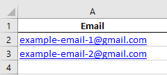
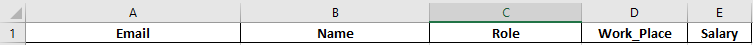
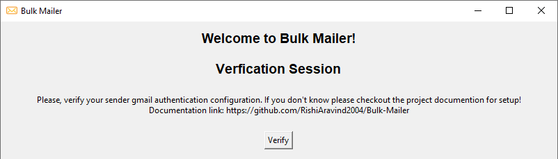
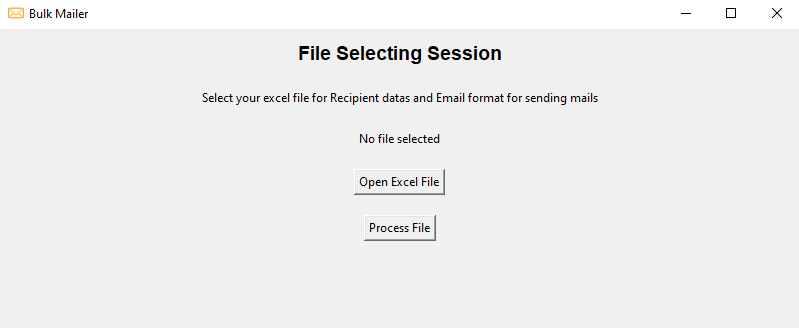
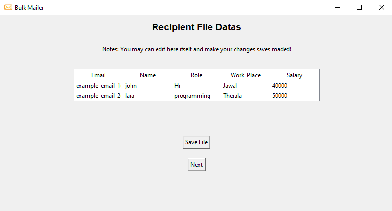
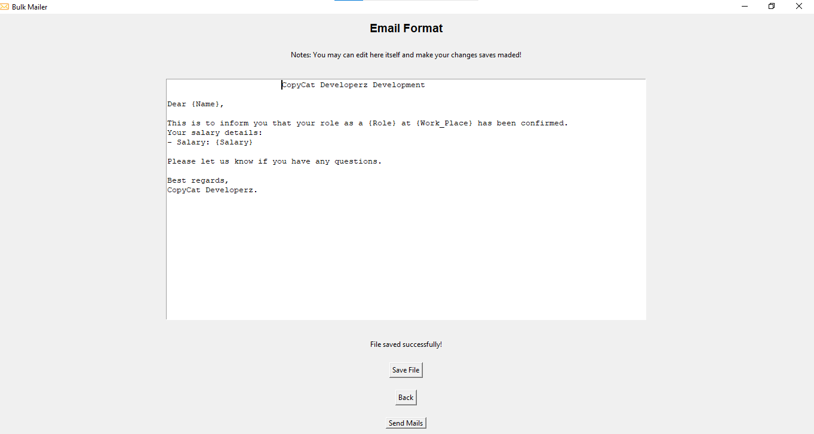
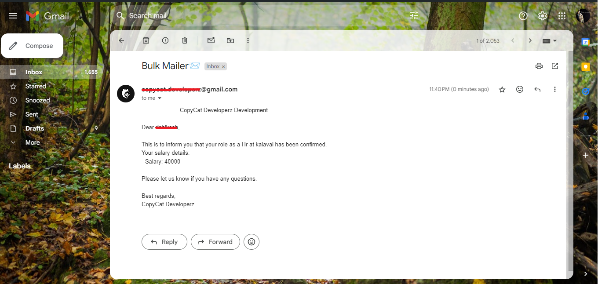
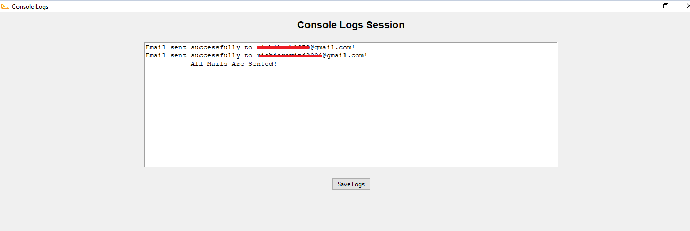
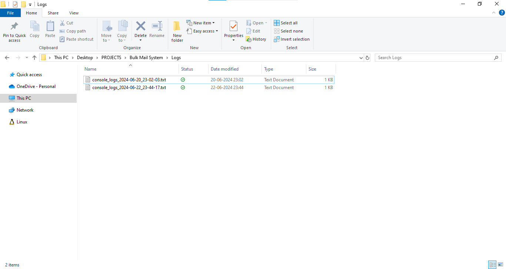

# Bulk-Mailer 
A way to send bulk mails with specific format of email with concurrent value from excel file.

To send bulk emails efficiently from Excel, this is a simple way and effective method that allows you to include additional user attributes and reference their values from the Excel sheet.

# Understanding the Method of Sending Emails from Excel

To understand the method of sending emails from Excel, follow these steps:

1. **Login with Google App Credentials:** Start by logging in with your Google app credentials. This will allow you to access the necessary features and permissions to send emails from Excel.
2. **Select Recipient Data:** Once logged in, you can select an Excel file that contains the recipient data. This file should include the email addresses of the recipients to whom you want to send the emails.
3. **Attach Mail Format:** Along with the recipient data, you should also attach a mail format. This format will serve as a template for the emails that will be sent to each recipient. It ensures consistency and provides a structure for the content of the emails.
4. **Send Emails:** After selecting the recipient data and attaching the mail format, you can proceed to send the emails. Each recipient's email address will be used to send a personalized email using the attached mail format.

# How to Setup?
> **Package Installation**

Install the required package to run this program, simply install the package by executing the following command in command prompt

```
pip install -r requirements. txt
```

After executing the command above in the command prompt, the installation of the required packages will be complete.

> **Setuping Google App Credentials**

First of all, you need to edit the Google app credentials in the file "Data/Sender-config.json" with your own credentials. Here's an example of how the file should be updated:
json

**Data/Sender-config.json**

```
{
  "App-password": "XXXX XXXX XXXX XXXX",
  "Sender-mail-id": "xxxxxxxxxxxxxxxxxxxxx@gmail.com"
}
```

Please replace "App-password" with your actual Google app password and "Sender-mail-id" with your sender gmail address.

If you're not familiar with how to obtain these Google app credentials, you can refer to the documentation on obtaining a Gmail app password. 
Here is the link to the documentation: [**Documentation Link**](https://github.com/RishiAravind2004/SMPT-Mailer?tab=readme-ov-file#how-to-get-gmail-app-password)

> **Recipent Data(Excel Data File)**

First, Make sure that your Excel column contains the header "Email" and it need to be one and only "Email" column to represent each recipient's email address. 



> [!NOTE]
> This program automatically converts attributes from their working format to a cleaned format with the correct structure. These cleaned attributes are exclusively used in the "Mail Format" to reference attribute values. For better clarity and to avoid confusion, it is recommended to make these changes directly in Excel.

Secondly, make sure that your attributes match the variable naming rules in Python. In Python, variables should follow certain conventions to ensure readability and maintainability of the code. Here are some guidelines for naming variables in Python 
    - Variable names should be descriptive and meaningful, reflecting the purpose or content of the variable.
    - Variable names should start with a lowercase letter and can include letters, numbers, and underscores.
    - Avoid using reserved words or built-in function names as variable names.
    Python is case-sensitive, so myVariable and myvariable would be considered different variables.

Where the attributes to be variable , for example:



For example, if you have an attribute named "Work Place", Python doesn't allow spaces in variable names, so you should replace spaces with underscores (_) instead like "Work_Place".

The appropriate replacement symbols:

| Symbol  | Replaced Symbol |
| ------------- | ------------- |
| Space( )  | Underscore(_)  |
| Hyphen(-)  | Underscore(_)  |
| Colon(:)  | Nothing()  |
| Dot(.)  | Nothing()  |

These attributes are going to used to reference the concurrent value of respective Recipent Data.

> **Mail-Format**

This file contains the mail format represented with attributes.

For example, assuming you have attributes like "Email", "Name", "Work Place" (cleaned as "Work_Place"), "Role", and "Salary", 
Create a template of the email in a text file. Use curly braces ({}) on both sides of the attribute name like {attribute} to represent the attribute values.

**Data/Mail-format.txt**
```
			CopyCat Developerz Development

Dear {Name},

This is to inform you that your role as a {Role} at {Work_Place} has been confirmed.
Your salary details:
- Salary: {Salary}

Please let us know if you have any questions.

Best regards,
CopyCat Developerz.
```
<<<<<<< HEAD
=======

# How to Run and Functionality?

To run the main project file Bulk-Mailer.py, use the run module mode.

Upon running the file, an interface for the bulk mailer will appear as shown below:



Click the "Verify" button to validate your Google App credentials.

Once verified, you will be directed to a file selection session:



Here, select an Excel file containing recipient data. Ensure that the file meets the mentioned requirements. Before proceeding, confirm that your mail format file is set up in the directory "Mail-format.txt".

After processing these files, an interface for editing the Excel file will appear. You can make necessary edits directly in this editing area and save the file. Saving the file will reflect edited changes to the original file.



Similarly, there is an editing area for the "mail format" file. Make any necessary changes here and save the file.



Once all changes are made and saved, click the "Send Mail" button to initiate the mail sending process. A pop-up will prompt you to enter the subject for the mail being sent.

![alt text]images/image-6.png

After entering the subject, the mails will begin sending to each email in the recipient data with concurrent values.



You can monitor the status of mail sending in the "Console logs" pop-up.



To save the logs after sending all mails, click the "Save Logs" button. This action will automatically save the logs in the "logs" directory.



**-Happy Mailing😺!**